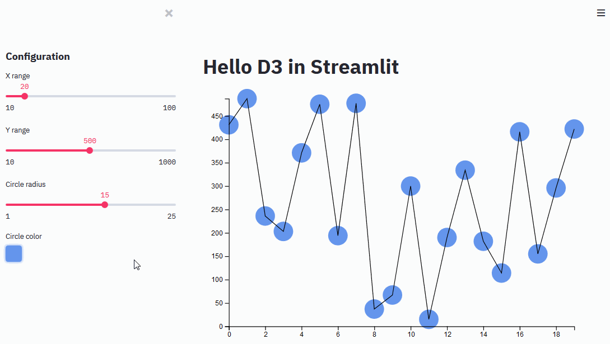

# D3 Demo in Streamlit

Testing D3 in React hooks in Streamlit ! Feel free to grab the inspiration :).



## Install

```shell script
pip install -i https://test.pypi.org/simple/ --no-deps streamlit-d3-demo
```

## Run

```shell script
streamlit run app.py
```

## Development 

### Install

* JS side

```shell script
cd frontend
npm install
```

* Python side 

```shell script
conda create -n streamlit-d3 python=3.7
conda activate streamlit-d3
pip install streamlit-0.61.0-py2.py3-none-any.whl
```

### Run

* JS side

```shell script
cd frontend
npm run start
```

* Python side

```shell script
streamlit run app.py
```

## References

D3 :
* https://observablehq.com/@d3/learn-d3
* https://observablehq.com/@d3/margin-convention
* https://wattenberger.com/blog/d3
* https://wattenberger.com/blog/d3-interactive-charts
* https://spin.atomicobject.com/2017/07/20/d3-react-typescript/
* https://medium.com/@kj_schmidt/show-data-on-mouse-over-with-d3-js-3bf598ff8fc2

React :
* https://kentcdodds.com/blog/usememo-and-usecallback
* https://overreacted.io/a-complete-guide-to-useeffect/

D3 + React hooks :
* https://wattenberger.com/blog/react-and-d3
* https://medium.com/@jeffbutsch/using-d3-in-react-with-hooks-4a6c61f1d102
* https://www.youtube.com/playlist?list=PLDZ4p-ENjbiPo4WH7KdHjh_EMI7Ic8b2B
* https://observablehq.com/@herrstucki/react-hooks-and-d3
* https://clhenrick.io/animating-svg-d3-react-hooks/
* https://medium.com/@stopyransky/react-hooks-and-d3-39be1d900fb
* https://swizec.com/blog/easy-d3-blackbox-components-react-hooks/swizec/8689
* https://dev.to/benjaminadk/basketball-stats-through-d3-react-4m10
* https://medium.com/stationfive/how-to-create-a-pie-chart-with-d3-js-and-react-hooks-part-1-81bcd7f39b32

D3 + React class component :
* https://hackernoon.com/how-and-why-to-use-d3-with-react-d239eb1ea274/
* https://www.smashingmagazine.com/2018/02/react-d3-ecosystem/
* https://gist.github.com/alexcjohnson/a4b714eee8afd2123ee00cb5b3278a5f
* https://blog.logrocket.com/data-visualization-in-react-using-react-d3-c35835af16d0/
* https://www.freecodecamp.org/news/how-to-get-started-with-d3-and-react-c7da74a5bd9f/
* https://grafana.com/tutorials/build-a-panel-plugin-with-d3/#6
* https://stackoverflow.com/questions/49611148/how-to-add-tooltip-in-react-d3-v4-bar-chart
* https://stackoverflow.com/questions/38116805/react-js-d3-charts-tooltip/56674517#56674517


## Steps

* Build an svg, select it through useRef then append circles like classic d3. [Ask yourself](https://wattenberger.com/blog/react-and-d3) lots of existential questions
on d3 mutating things React would like to manage...https://medium.com/stationfive/how-to-create-a-pie-chart-with-d3-js-and-react-hooks-part-1-81bcd7f39b32 and
https://www.youtube.com/playlist?list=PLDZ4p-ENjbiPo4WH7KdHjh_EMI7Ic8b2B got me to stick to react hooks
* Add path and be happy :)
* Append group containers on mount and mutate those groups with d3
* Fight with TS typing on d3, [put type any at the end](https://spin.atomicobject.com/2017/07/20/d3-react-typescript/) 
because _One important thing to note is that when you set variables from a D3 operator, the variable type will need to 
be set to any. This is because D3 types can be a bit lengthy to use unless you extend, and in some cases, 
they will cause a possible variable undefined error._
* Update axis, circles and path yay by entering/removing everything 
* Learn to key join on path to only update, not append/remove each time
* debounce and update problem on circles, Streamlit updates multiple times, readd color blue and radius on update, because circles are entered then 
updated immediately, I should debounce on my side..
* try to fill on mouseover but [d3.select(this)](https://stackoverflow.com/questions/23703089/d3-js-change-color-and-size-on-line-graph-dot-on-mouseover) 
doesn't like me, but [here](https://dev.to/benjaminadk/basketball-stats-through-d3-react-4m10) it works ? workaround :
with _this_ as the current DOM element (nodes[i]) so I just put nodes[i].
* doing mouseover. fun fact but if during exit I mouseover then element is not removed XD. Oh put fill change in css instead
* there's a resize observer on Streamlit that spawns rerenders ? This reruns line updates too so line stays grey huum
